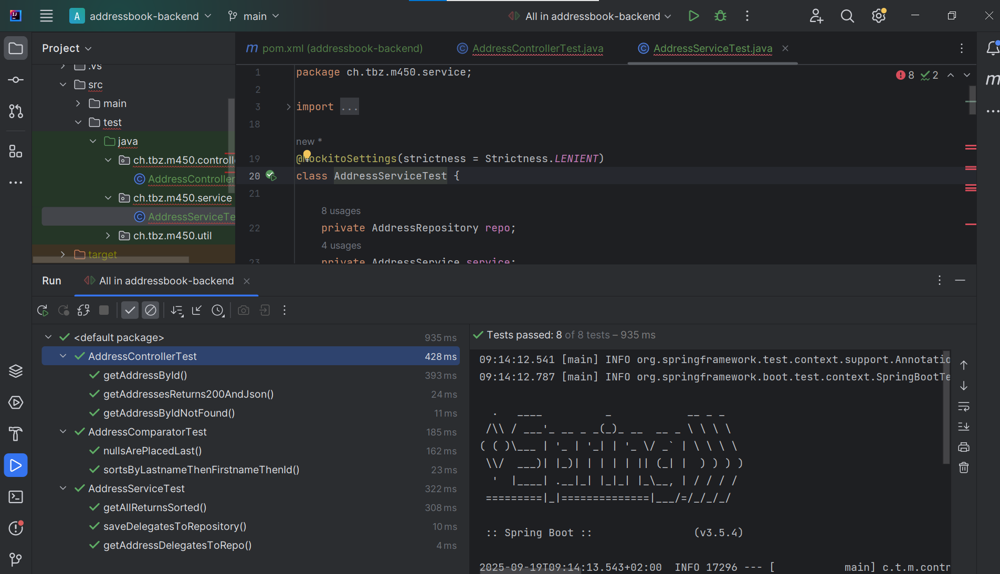

# Addressbook Backend – Tests ausführen

Dieses Projekt enthält JUnit-Tests für den Addressbook-Backend-Service.

## Voraussetzungen
- IntelliJ IDEA (oder eine andere Java-IDE)
- Maven Wrapper (`mvnw` / `mvnw.cmd`)
- Java 21 SDK installiert und im Projekt eingestellt

## Tests ausführen

### Variante 1: IntelliJ IDEA
1. Stelle sicher, dass du das **innere Projektverzeichnis** mit der `pom.xml` geöffnet hast.
2. Rechtsklick auf `src/test/java` → **Mark Directory as → Test Sources Root**.
3. Rechtsklick auf eine Testklasse, z. B. `AddressServiceTest` → **Run 'AddressServiceTest'**.
4. Das Ergebnis erscheint unten im **Run Fenster**.

### Variante 2: Konsole
Im Projektordner (dort wo die `pom.xml` liegt) ausführen:

```bash
# Windows PowerShell / CMD
mvnw.cmd test

# Linux / Mac
./mvnw test
````
Ergebnisse

