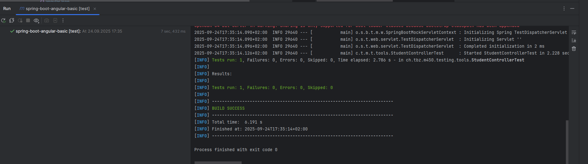
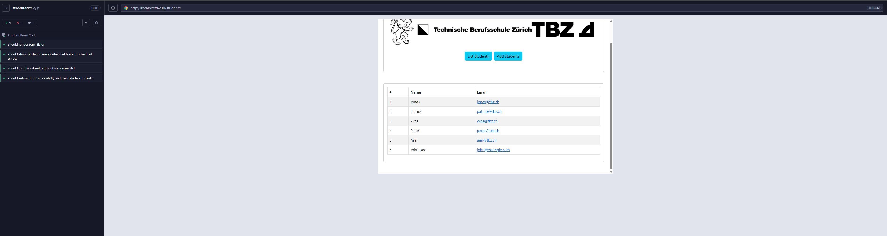

# QA & Testing – Aufgabenübersicht

---

### Aufgabe 1 Automatische Tests und Testing-Tools Backend
- Tool suchen für REST Schnittstelle automatisch testen:
    - Mockito

### Aufgabe 2 Automatische Tests und Testing-Tools Frontend
- Tool suchen für das GUI Frontend automatisch zu testen:
    - Cypress

---